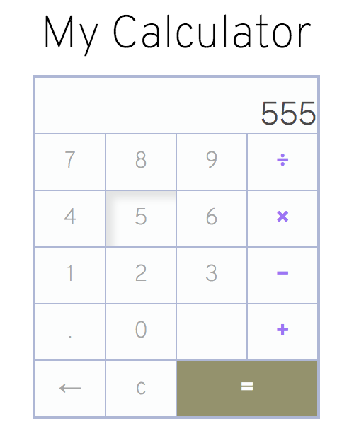

# JS Calculator

> This is the final project of the Web Development 101 course in Odin Project's Javascript Basics.
The calculator will allow you to make basic operations using your mouse, keyboard or touchscreen gestures. 

# Screenshot

I created this app entirely from sractch with JS, HTML and CSS. The calculator allows the use of big numbers, and has a mouse-click and a keyboard interface.
It is possible to do *chain* operations too. So you can do something like, `2 * 5 + 10`, and get `20`.

## Built With
- Javascript, HTML, and CSS

## Live Demo

[Live Demo Link](https://starsheriff2.github.io/Calculator/)

## Getting Started
To get a local copy up and running follow these simple example steps.

### Prerequisites
- Linux/Mac Operating systems

### Setup
1. Open your terminal or command prompt.
2. If you don’t have git installed in your system, skip this step and go to step 3. If you do have git installed in your system, clone this repository to your computer in any directory you want by copying this text into your command prompt/terminal: `git clone git@github.com:StarSheriff2/Calculator.git`.
3. If you don't have git installed in your system, you can download the program files. To do this, click on the green button that says "**Code**", on the upper right side of the project frame.
4. You will see a dropdown menu. Click on "**Download ZIP**".
5. Go to the directory where you downloaded the **ZIP file** and open it. Extract its contents to any directory you want in your system.

### Usage
1. To run the program, go to the projects's root directory *(the directory where you cloned the remote repository or extracted the project files)* and open the **index.html** file. This will open the calculator app in your default browser
2. To use the calculator use your mouse to click the buttons for the number keys, or operators. You can also use your keyboard
3. You can also use this calculator in your smartphone by using the live [link](https://starsheriff2.github.io/Calculator/)

## Authors

👤 **Arturo Alvarez**

- GitHub: [@StarSheriff2](https://github.com/StarSheriff2)
- Twitter: [@Turo_83](https://twitter.com/Turo_83)
- LinkedIn: [Carlos Alvarez](https://www.linkedin.com/in/carlosalvarezveroy/)

## Contributing

Contributions, issues, and feature requests are welcome!

Feel free to check the [issues page](https://github.com/StarSheriff2/Calculator/issues).

## Show your support

Give a ⭐️ if you like this project!

## 📝 License

This project is [MIT](https://github.com/StarSheriff2/Calculator/blob/master/LICENSE) licensed.
